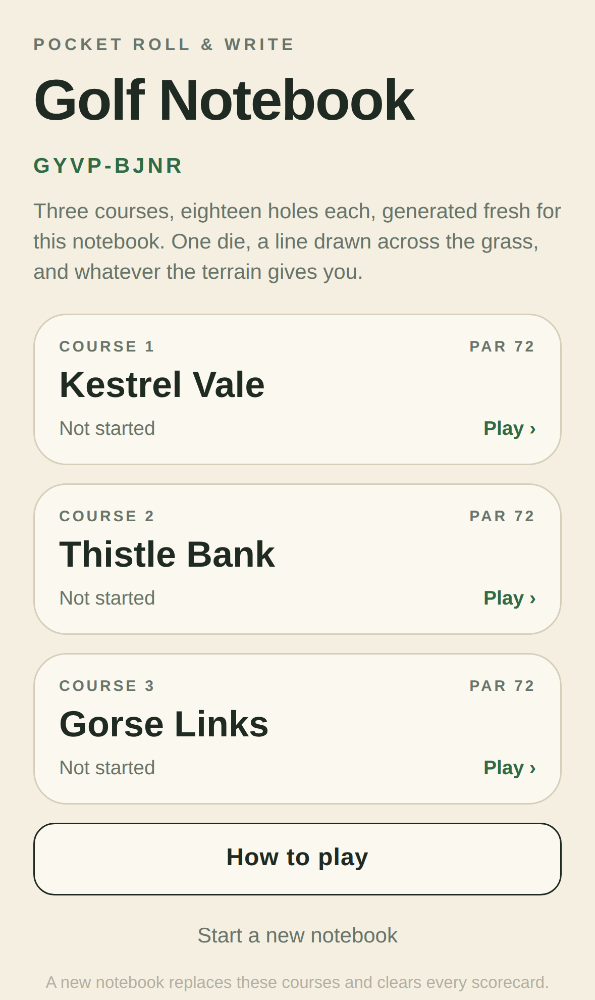
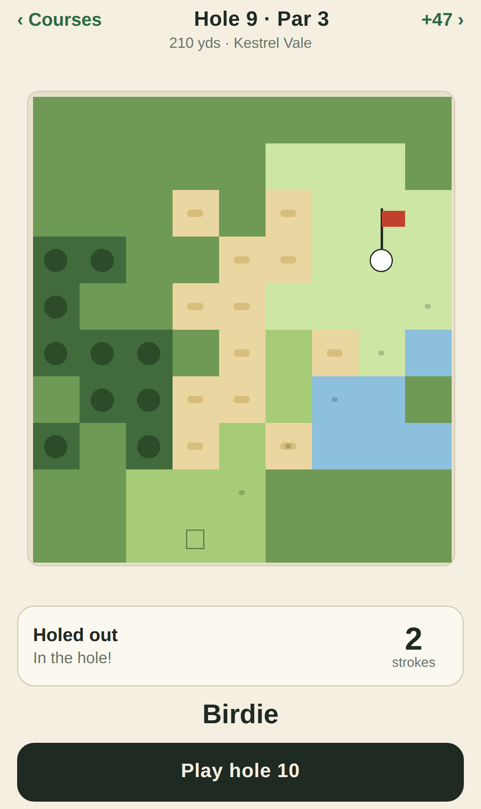
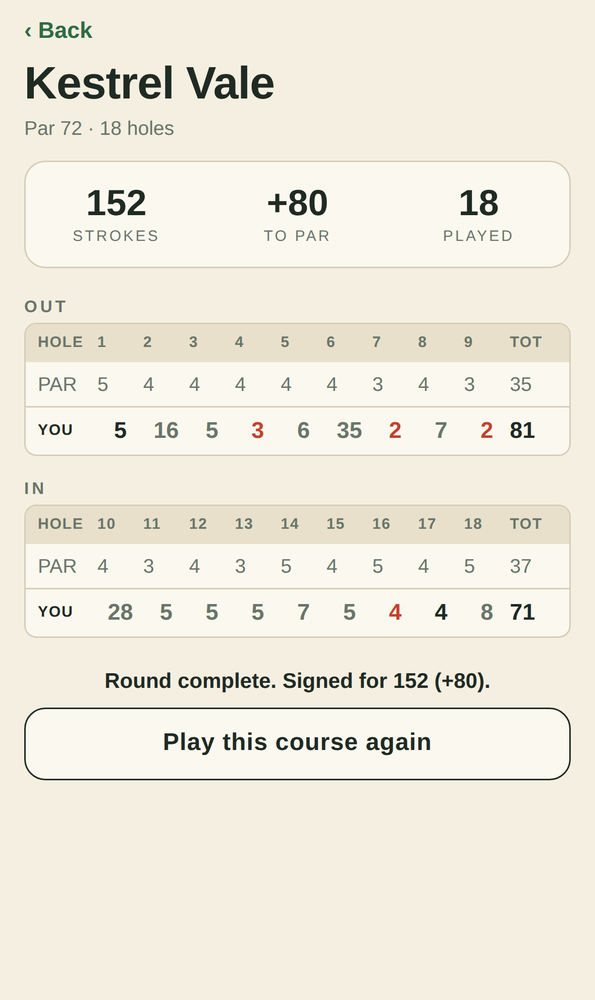

# Golf Notebook

An iPhone app version of the pocket roll-and-write golf notebook — a solo golf game
played with one die on a grid of terrain.

Built with Expo and React Native, in TypeScript. The game rules live in a pure
TypeScript core with no UI dependencies, so they are covered by an ordinary node
test suite.

| | | |
| --- | --- | --- |
|  |  |  |

## Playing it on your iPhone

The quickest route, no Mac required:

1. Install **Expo Go** from the App Store.
2. On your computer: `npm install` then `npx expo start`.
3. Scan the QR code in the terminal with the iPhone camera.

For a real standalone app on your home screen, build with
[EAS](https://docs.expo.dev/build/setup/):

```sh
npm install -g eas-cli
eas login
eas build --platform ios --profile preview
```

The bundle identifier is `com.golfnotebook.app`; change it in `app.json` if you
are building under your own Apple account.

## The rules

Each hole is a grid. The ball starts on the tee at the bottom, the flag is up the
page, and you get there in as few strokes as you can.

**A stroke.** Aim in one of eight directions — tap a square to point that way, or
nudge with the arrows. Roll the die: that number, adjusted for your lie, is how
many squares the ball travels in a straight line. The dotted line shows exactly
where the ball will finish before you commit to the shot.

**The lie** changes how far the roll carries:

| Lie | Carry |
| --- | --- |
| Fairway (and the tee) | roll + 1 |
| Green | putting — play any distance up to the roll |
| Rough | roll − 1 |
| Bunker | roll − 2 |
| Trees | punch out, 2 squares at most |

A shot always travels at least one square, however bad the lie.

**Trouble.** The ball flies over water freely but may not come to rest in it:
that is a penalty stroke and a drop at the last dry square it flew over. Leaving
the hole altogether is stroke and distance. Trees stop a shot dead where it hits
them.

**Holing out.** The ball has to come to rest in the cup, so flying over the flag
does nothing. On the green you control the pace — any distance from one square up
to your roll — which is how you drop the last putt.

**The notebook.** A notebook code generates three courses of eighteen holes, par
72 each. The same code always produces the same courses, so you can replay a
round or hand the code to someone else and play exactly the same golf.

### On the rules

This is an adaptation, not a port. The published description of the paper game
gives the shape of it — one die, terrain of fairway, rough, water, sand and
trees, a boost from the fairway, a shortened shot from sand, and a ball that may
fly over water but not land in it — but the exact numbers are printed only in the
notebook itself. The carry table above is this app's own reading, tuned so that a
round comes in near par. Everything is in `src/core/` if you want to dial it to
match your copy.

## Layout

```
App.tsx              screen switching and save state
src/core/            the game itself, pure TypeScript, no React
  rng.ts             seeded RNG so a notebook code is reproducible
  hole.ts            terrain generation for a single hole
  course.ts          18 holes at par 72, three courses to a notebook
  shot.ts            how a roll and a lie become a ball on a square
  play.ts            hole state, legal shots, and a greedy reference player
  scoring.ts         scorecards, totals, birdies and bogeys
src/screens/         home, play, scorecard, rules
src/ui/              the hole renderer, die, buttons, palette
```

## Development

```sh
npm test        # the rules, 23 tests
npm run typecheck
npm run inspect <seed> <hole>   # print a hole as text and play it with the bot
npm run web     # run in a browser, useful for quick UI checks
```

The test suite includes a playability check: a greedy reference player finishes
every hole of every generated course, which is what guarantees hazard placement
can never wall off the green.
